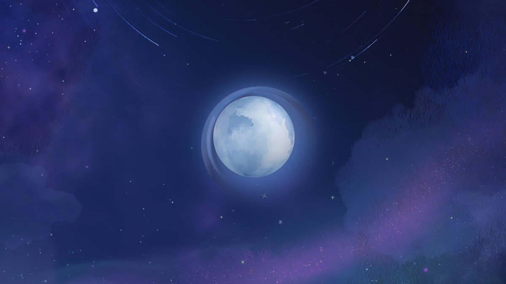

# Genshin Impact Moon


[Song of the Welkin Moon - 空月之歌](https://qirong77.github.io/genshin-impact-moon/)



## 项目简介

**Genshin Impact Moon** 是一个基于 Three.js 构建的 3D 场景展示项目，灵感来源于《原神》的空月之歌场景。项目通过丰富的星环、流星背景、卫星等元素，营造出梦幻般的深空场景。

## 功能特性

- **星环效果**：动态星环，支持自定义颜色、透明度、随机性等参数。
- **流星背景**：动态流星效果，增强场景的沉浸感。
- **卫星系统**：可旋转的卫星和装饰元素。
- **GUI 控制**：通过 lil-gui 实现实时参数调整。
- **响应式渲染**：支持窗口大小变化的自动调整。

## 本地开发

### 环境要求

- Node.js >= 18

### 安装依赖

```bash
npm install
```

### 启动开发服务器

```bash
npm run dev
```

### 构建项目

```bash
npm run build
```

### 预览构建结果

```bash
npm run preview
```

## 项目结构

```
src/
  ├── common/      # 通用工具和配置
  │   ├── axisHelper.ts       # 坐标轴辅助工具
  │   ├── gui.ts              # GUI 控制面板
  │   ├── main.ts             # Three.js 场景初始化
  │   └── resizeRendererToDisplaySize.ts # 渲染器尺寸调整
  ├── scene/       # 场景模块
  │   ├── 1-mask/             # 场景遮罩与启动界面
  │   ├── 2-moon/             # 月亮场景
  │   │   ├── components/     # 月亮场景组件
  │   │   └── moon-gui.ts     # 月亮场景的 GUI 配置
  │   ├── 3-wheel/            # 星环场景
  │   │   ├── components/     # 星环场景组件
  │   │   └── groups/         # 星环场景组合
  │   └── common/             # 通用场景组件
  ├── style.css    # 全局样式
  └── main.ts      # 项目入口文件
```


## 许可证

MIT License